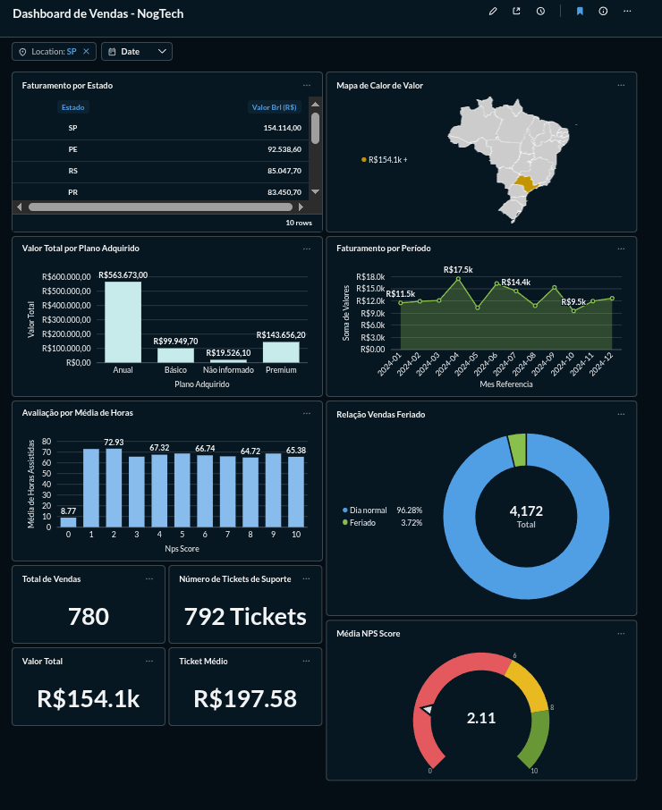
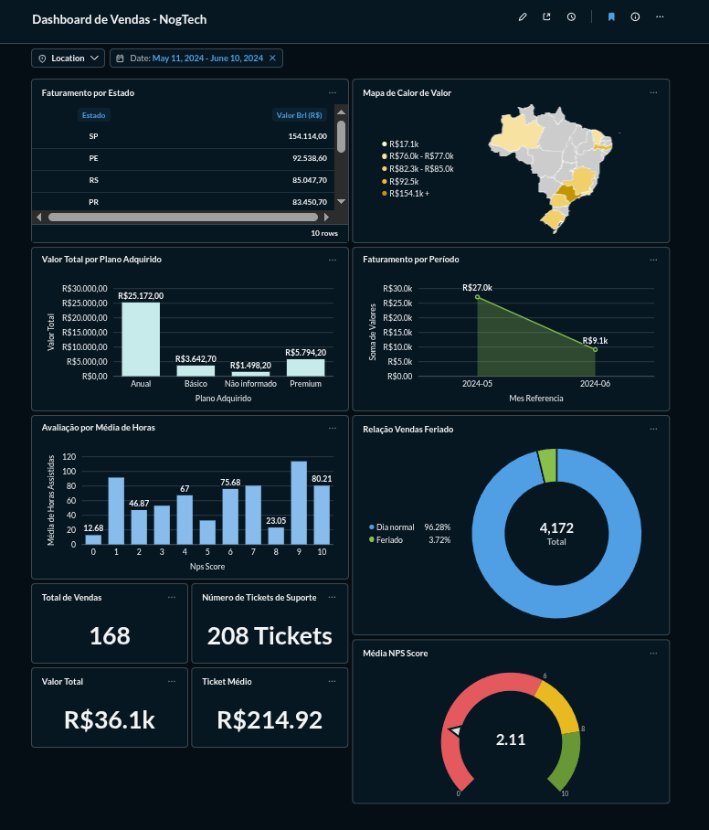
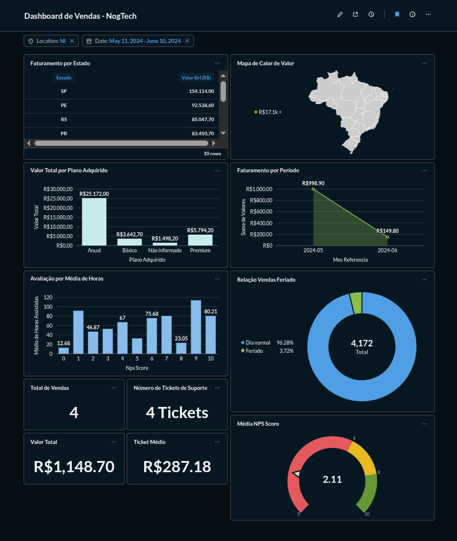
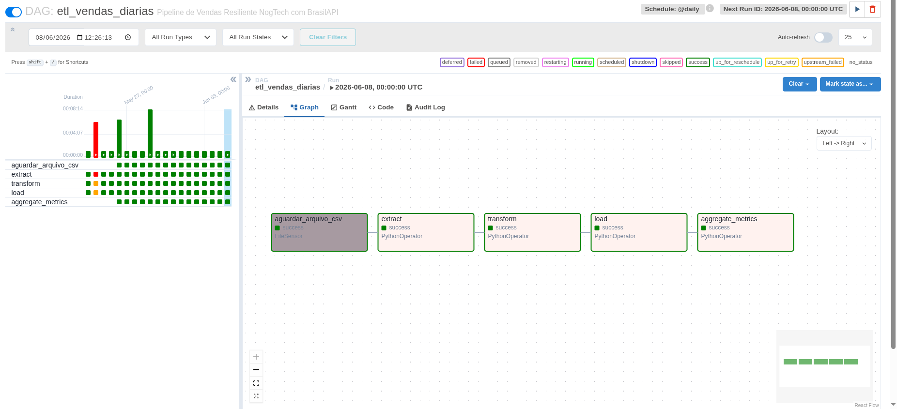
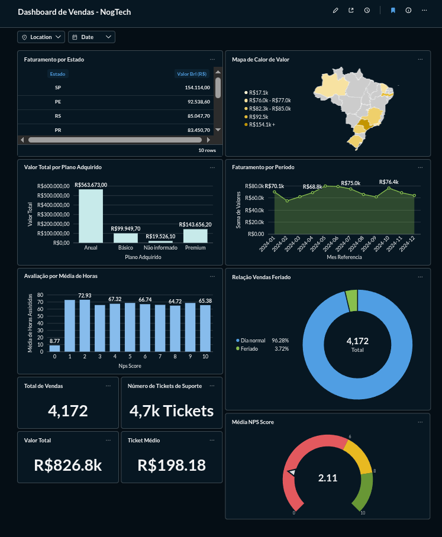

# Pipeline de ETL e Dashboard Analítico de Vendas (NogTech) 🚀

Este projeto apresenta uma solução completa de Engenharia de Dados de ponta a ponta, desenvolvida para processar, enriquecer e analisar os dados de vendas e engajamento da plataforma educacional **NogTech**. A arquitetura foi totalmente containerizada e orquestrada de forma profissional com **Apache Airflow**, garantindo robustez, idempotência e governança de dados (LGPD).

---

### 🎥 Demonstração Completa do Projeto

> 💡 **Nota:** Clique na imagem acima ou [neste link direto](https://www.youtube.com/watch?v=IF-XPscPmO4) para assistir ao vídeo de apresentação com a explicação da arquitetura, a execução do pipeline no Airflow e a análise dos dados no Metabase.

---

## 🏗️ Arquitetura do Ecossistema

O ecossistema é baseado em microserviços isolados e integrados via **Docker Compose**, minimizando o consumo de recursos locais e garantindo portabilidade absoluta:

> **[Fontes Brutas]** (CSV / JSON) 
> ➡️ **[Apache Airflow]** (Orquestração / Extração / Transformação / Carga) 
> ➡️ **[Data Lake Local]** (Parquet Particionado + SQLite) 
> ➡️ **[Metabase]** (Dashboard C-Level)

### Componentes Utilizados:
* **Apache Airflow (v2.9.1):** Responsável pelo agendamento, monitoramento, interface de observabilidade (DAGs) e gestão de dependências.
* **Pandas & PyArrow:** Motores de processamento em memória e transformação de dados altamente tipados.
* **SQLite (Camada Analítica):** Banco de dados leve embarcado mapeado em disco para servir como repositório final de consumo.
* **Metabase (v0.49):** Ferramenta de Business Intelligence para visualização dinâmica de dados.

---
## 📊 Dashboard de Análise Executiva (NogTech)

<video src="https://github.com/user-attachments/assets/679b63e3-4e61-44b0-bc33-6a72eddf19d4" autoplay loop muted playsinline width="100%"></video>

### 📈 Breve Explicação dos Resultados (Diretoria NogTech)

> **Cenário Geral:** O pipeline processou e consolidou um volume total de **4.1K vendas** ao longo do ano de 2024, gerando um faturamento bruto de **R$ 826.8K** com um **ticket médio de R$ 198,18** por transação.

A análise cruzada dos dados tratados revela três grandes insights para a diretoria:
1. **Crise de Satisfação (NPS):** O NPS médio da plataforma está em **2.11 (Zona de Crítica)**. O gráfico de engajamento prova que os alunos que deram nota zero assistiram a menos de 9 horas de aula, indicando uma rejeição precoce ao conteúdo.
2. **Sobrecarga no Suporte:** Essa insatisfação gerou um volume alarmante de **4.7K tickets de suporte**, um número maior do que o próprio total de vendas, indicando falhas operacionais ou dúvidas severas no produto.
3. **Distribuição Geográfica e Sazonalidade:** O faturamento se concentra fortemente no estado de **SP (R$ 154.1K)**. Na linha do tempo, as vendas se mantêm estáveis mês a mês, oscilando entre R$ 55K e R$ 80K, sem grandes picos sazonais.

---

### 📸 Evidências Técnicas e Prints do Painel

<b>Clique aqui para visualizar os prints das telas e filtros</b>

#### Filtro por Estado (Exemplo: SP)

#### Filtro por Data

#### Funcionamento em Conjunto

---

## ⚡ Estratégias Técnicas do Pipeline (ETL)

O pipeline implementado na DAG `etl_vendas_diarias` atende a todos os requisitos de negócio, focando em engenharia de software de alta performance:

### 1. Extração (Extract) e Cruzamento (Join)
* A ingestão das fontes locais (CSV `latin-1` e JSON `utf-8`) é feita de forma automatizada.
* **Padronização prévia:** Foi implementada a reconstrução cronológica do mês de referência (formato `YYYY-MM`) e a limpeza dos CPFs antes do cruzamento (`LEFT JOIN`). Isso garantiu que nenhuma transação perdesse os dados de engajamento por falha de formatação.

### 2. Transformação (Transform) e Resiliência
* **Anonimização (LGPD):** Remoção definitiva da coluna de identificação direta (`nome_aluno`) e mascaramento rigoroso do CPF mantendo os 6 dígitos centrais (`***.XXX.XXX-**`).
* **Enriquecimento via BrasilAPI com Cache:** Integração para tradução de CEPs (Bairro, Cidade, Estado) e análise do calendário de Feriados Nacionais.
* **🛡️ Tratamento de Erros e Uso de Cache (Requisito Crítico):** Para evitar sobrecarga de rede e respeitar o limite da BrasilAPI pública, foram implementados **Caches em Memória** (Dicionários Python e Listas). A API é chamada apenas uma vez por CEP único ou Ano único. Além disso, foi aplicada a lógica de **Resiliência (Try/Except)**: caso a API caia, sofra *timeout* ou o CEP seja inválido, o pipeline não quebra. O algoritmo desvia o fluxo e cataloga os campos como `NI` (Não Informado), preservando os dados financeiros da transação.

### 3. Carga (Load) e Idempotência
* **Estratégia de Idempotência Adotada:** A opção escolhida foi o **Particionamento por data com Overwrite (Sobrescrita Limpa)**.
* **Justificativa:** Diferente de um UPSERT em banco de dados que exige constante verificação de chaves linha a linha (custoso para Big Data), a sobrescrita de partições (`shutil.rmtree`) garante que o diretório legado do respectivo Ano/Mês seja completamente higienizado antes de salvar os novos arquivos `.parquet`. Isso permite que o pipeline rode infinitas vezes no mesmo lote mantendo a consistência do *Data Lake* livre de poluição ou duplicidades, sendo a estratégia mais performática para processamento de arquivos distribuídos.

---

## 📊 Insights de Negócio Revelados

Ao plugar o Metabase na camada de consumo, o dashboard gerou descobertas críticas:
* **O Paradoxo do Suporte:** A empresa registrou cerca de 4,1 mil vendas totais, mas gerou uma volumetria de **4,7 mil Tickets de Suporte**. Há mais de um chamado por cliente cadastrado.
* **Depreciação do NPS:** Essa sobrecarga operacional reflete perfeitamente no **NPS Geral crítico de 2.11**.
* **Alerta de Churn (Cancelamento):** Alunos que avaliaram o curso com nota zero assistiram, em média, a apenas **8.7 horas**, enquanto o restante dos alunos manteve consumo acima de 65 horas. O atrito inicial com a plataforma está gerando cancelamentos rápidos.

---

### 🚀 Como Executar o Projeto Localmente

**Passo 0: Preparar os Dados de Amostra**
Para simular a ingestão de dados, o Airflow precisa encontrar os arquivos com os nomes exatos na pasta correta:
1. Copie os arquivos que estão dentro da pasta `mock_data/` para dentro da pasta `data/` (na raiz do projeto).
2. Na pasta `data/`, renomeie os arquivos de amostra para **`transacoes_nogtech.csv`** e **`engajamento_alunos.json`** (remova a parte "_amostra"). É este nome exato que o pipeline monitora.

**Passo 1: Configurar Permissões de Usuário (Linux/Mac)**
Para garantir que o Docker tenha as permissões corretas de leitura e escrita nos volumes locais, crie um arquivo `.env` com o seu identificador de usuário. No terminal, na raiz do projeto, execute:

    echo -e "AIRFLOW_UID=$(id -u)" > .env

*(Nota: Usuários de Windows com Docker Desktop podem pular esta etapa).*

**Passo 2: Iniciar a Infraestrutura**
Levante os contêineres em segundo plano executando o comando abaixo:

    docker-compose up -d

> ⏳ **Aviso:** O Apache Airflow é uma ferramenta robusta. Aguarde cerca de 2 a 3 minutos para que o banco de dados interno seja inicializado completamente na primeira execução.

**Passo 3: Acessar o Orquestrador (Airflow)**
Abra o seu navegador e acesse a interface do Airflow em: `http://localhost:8080`
* **Usuário:** `airflow`
* **Senha:** `airflow`

**Passo 4: Configurar a Conexão de Arquivos (Governança)**
Por questões de segurança, o Airflow exige que o acesso ao sistema de arquivos local seja explicitamente autorizado. Para que o sensor de arquivos funcione corretamente:
1. No menu superior, vá em **Admin > Connections**.
2. Clique no botão azul **+ (Add a new record)**.
3. Preencha apenas dois campos:
   * **Connection Id:** `fs_default`
   * **Connection Type:** `File (path)`
4. Clique no botão **Save**.

**Passo 5: Executar o Pipeline**
1. Na tela inicial (DAGs), ative o pipeline `etl_vendas_diarias` clicando no botão de *toggle* à esquerda.
2. Caso a primeira tarefa (`aguardar_arquivo_csv`) tenha falhado ou ficado travada enquanto você configurava a conexão, clique nela, selecione o botão **Clear** e confirme. O Airflow retomará a execução e encontrará os arquivos do Passo 0 instantaneamente!

**Passo 6: Visualizar os Dados no BI (Metabase)**
Após a DAG ser executada com sucesso e os arquivos `Parquet` limpos e padronizados serem criados, os dados estarão prontos para consumo na camada visual.
Acesse no seu navegador: `http://localhost:3000`
1. Crie a sua conta de administrador local (apenas para acesso à sua própria máquina).
2. Adicione um novo banco de dados escolhendo o motor **SQLite**.
3. Explore os dados e cruze as informações!

> ⚠️ **Nota Técnica sobre Exportação de Dashboards:** O Metabase utiliza um banco de dados interno em contêiner (H2) para armazenar suas configurações visuais. Para evitar quebras de caminhos absolutos (*Absolute Paths*) em sistemas operacionais diferentes e conflitos de infraestrutura, os arquivos do painel gerado não são versionados neste repositório Git. A comprovação integral da inteligência de negócios extraída da base pode ser conferida através dos prints de demonstração na pasta `assets/` e no vídeo de apresentação deste projeto.

*Projeto desenvolvido como portfólio de Engenharia de Dados e Business Intelligence.*
